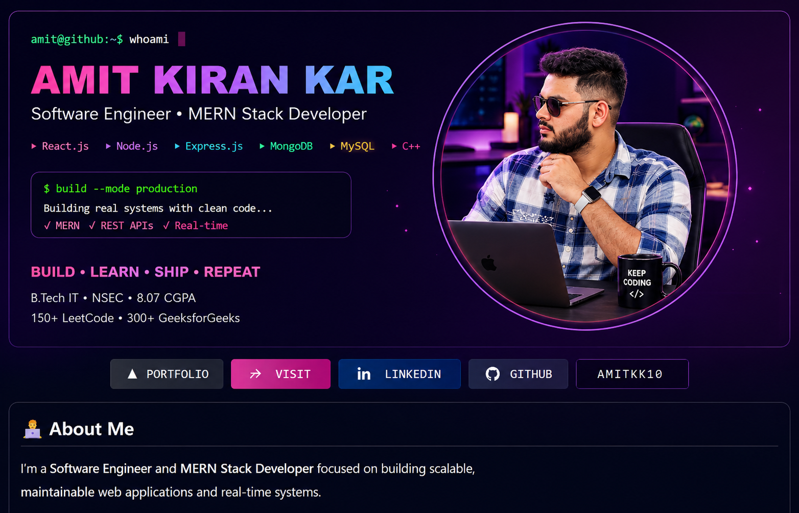

 

## 👨‍💻 About Me

I'm a **Software Engineer and MERN Stack Developer** focused on building scalable, maintainable web applications and real-time systems.

- 💼 Software Developer at **Fiber Max Services Pvt. Ltd.**
- 🎓 B.Tech in Information Technology — **8.07 CGPA**
- 🧠 Strong foundation in **DSA, OOPs, DBMS and backend REST APIs**
- ⚡ Experience with **payments, RBAC, wallets, real-time systems and admin workflows**
- 🧩 I enjoy turning ideas into practical, production-oriented applications
- 🏏 Cricket | 💰 Finance | 📚 Teaching

## 🛠️ Tech Stack

**Languages:** C++, JavaScript (ES6+)

**Frontend:** React.js, Redux Toolkit, HTML5, CSS3, Tailwind CSS

**Backend:** Node.js, Express.js, REST APIs, JWT, Socket.IO

**Database:** MongoDB, MySQL

**Tools:** Git, GitHub, Razorpay, MVC Architecture

## 💼 Experience

### Software Developer — Fiber Max Services Pvt. Ltd.

**May 2026 – Present · Rourkela, Odisha**

- Developing scalable and maintainable web applications using the MERN stack.
- Designing and integrating secure RESTful APIs with optimized backend logic and database management.
- Collaborating in an Agile/Scrum environment to deliver software solutions.
- Debugging production issues and building reusable frontend/backend components.

## 🚀 Featured Projects

### 🏆 Offer Bridge — Fintech Escrow Platform

A P2P escrow-based commission platform connecting Merchants, Customers and Admins through secure deal workflows.

**Highlights**

- Atomic wallet and transaction ledger
- Escrow-based payment locking
- 30-minute deal acceptance and automatic expiry
- Razorpay payments
- JWT-based RBAC
- Socket.IO real-time updates
- OTP-based delivery confirmation

[Live Demo](https://offer-bridge.onrender.com/) · [Source Code](https://github.com/AmitKK10/Offer-Bridge)

### 🍕 Pizza Dispatch — Real-time Ordering App

A MERN-based ordering platform with payments, customized pizza building and inventory management.

- Redux Toolkit state management
- Razorpay payment integration
- Dynamic pizza builder and price calculation
- Automated inventory tracking
- Real-time stock synchronization

[Frontend](https://github.com/AmitKK10/Pizza-App-Frontend) · [Backend](https://github.com/AmitKK10/Pizza-App-Backend)

### 🤖 AI Virtual Assistant

A React-based AI assistant interface focused on modular component architecture, clean UX and real-time interactions.

[Repository](https://github.com/AmitKK10/AI-Virtual-Assistant)

### 🌐 Developer Portfolio

My personal portfolio showcasing projects, skills and developer work.

[Live Portfolio](https://amitkk-portfolio.vercel.app/) · [Source Code](https://github.com/AmitKK10/amitkk-portfolio)

## 📊 Coding Journey

| Platform | Progress |
|---|---:|
| 🟨 LeetCode | **150+ problems** |
| 🟩 GeeksforGeeks | **300+ problems** |
| 🟦 HackerRank | **3-Star SQL Badge** |

## 🎓 Education

**B.Tech in Information Technology**  
Netaji Subhash Engineering College · 2022–2026 · **CGPA: 8.07**

## 🐍 Contribution Activity

## 📜 Certifications

- SQL & Relational Databases — IBM
- Full Stack MERN Certification — ASD

## 📫 Connect With Me

**Let's build something useful.**

---

**BUILD • LEARN • SHIP • REPEAT**

